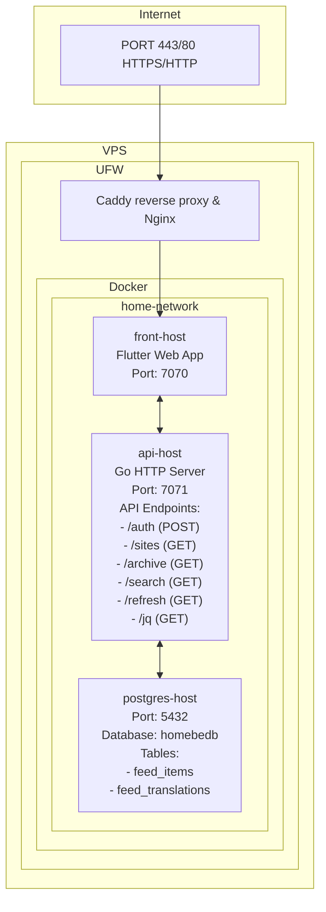
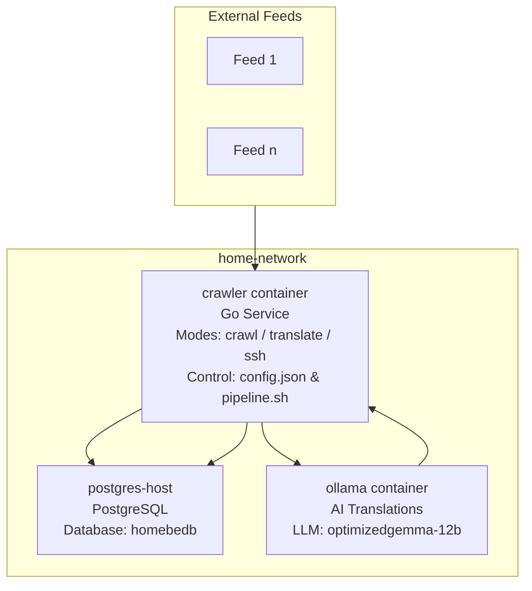

# System Architecture

## Overview

A Flutter (Dart) frontend application communicating with a Golang backend, both running in Docker containers connected via a shared Docker network. The backend serves as the API layer connecting to a PostgreSQL database for persistent storage.

---

## 1. Application Layers

### Frontend (home_fe)
- **Language**: Dart/Flutter
- **Version**: >=3.41.5 (minimum required version)
- **Port**: 7070
- **Container Name**: `front-host`
- **Reverse Proxy**: Nginx (HTTPS via Caddy config)
- **Architecture**: Mobile/Desktop/Web hybrid app
- **Key Features**: 
  - RSS feed aggregation and display
  - Multi-platform support (iOS, Android, Desktop)
  - Localization support (English, Thai locales)
  - Image caching with thumbnail generation

### Backend (home_be)
- **Language**: Go (Golang)
- **Version**: 1.24.0
- **Port**: 7071
- **Container Name**: `api-host`
- **HTTP Server**: Net/http stdlib or third-party framework
- **Database**: PostgreSQL (`postgres://postgres:<pass>@host/homebedb?sslmode=disable`)
- **Security**: 
  - All endpoints require `code=123` query parameter for authentication
  - CORS enabled globally

### Data Layer
- **Database**: PostgreSQL container on `home-network`
- **Port**: 5432
- **Container Name**: `postgres-host`
- **Connection String**: `postgres://postgres:<pass>@host/homebedb?sslmode=disable`
- **Usage**: Backend stores and retrieves news content, user preferences, configuration

---

## 2. Architecture



**Terminology:**
- **VPS**: Virtual Private Server
- **UFW**: Uncomplicated Firewall
- **Caddy**: Reverse proxy
- **Nginx**: Web server
- **Docker**: Container runtime
- **PostgreSQL**: Database management system

**Caddy/Nginx → Frontend → Backend → PostgreSQL**

*User requests (HTTPS) via reverse proxy serve front-end container, which communicates with backend via hostnames directly within Docker network. Database connection requires internal hostname resolution only.*

---

## 3. API Endpoints

### Backend API Endpoints (api-host:7071)

All endpoints require authentication via `code=123` query parameter.

#### Content Management Endpoints
- **GET /archive**
  - **Purpose**: Retrieve archived news items with pagination
  - **Parameters**: 
    - `code=123` (required)
    - `offset` (optional, default: 0) - Pagination offset
    - `limit` (optional, default: 10) - Items per page
    - `lang` (optional) - Language filter
  - **Response**: NewsItems object with archived articles
  - **Used by**: `archive()` method

- **GET /search**
  - **Purpose**: Search news articles by query
  - **Parameters**:
    - `code=123` (required)
    - `q` (required) - Search query string
    - `lang` (optional) - Language filter
  - **Response**: NewsItems object with search results
  - **Used by**: `search()` method

- **GET /refresh**
  - **Purpose**: Trigger refresh of RSS feeds/content
  - **Parameters**: `code=123`
  - **Response**: Status code and data
  - **Used by**: `refresh()` method

- **GET /sites**
  - **Purpose**: Retrieve RSS feed sites configuration
  - **Parameters**: `code=123`
  - **Response**: RssSites object with available RSS sources
  - **Used by**: `sites()` method

#### Configuration Endpoints
- **GET /jq**
  - **Purpose**: Retrieve backend configuration
  - **Parameters**: `code=123`
  - **Response**: Config object with backend settings
  - **Used by**: `getConfig()` method

#### Authentication Endpoints
- **POST /auth**
  - **Purpose**: Mimic user login and token refresh
  - **Response**: Token object with access token, refresh token, etc.
  - **Used by**: `login()`, `refreshLogin()` methods

### Frontend API Implementation

The Flutter frontend uses the `ApiRepository` class with the following pattern:
```dart
// All requests follow this structure:
List<Future<dynamic>> futures = [];
futures.add(client.get('/endpoint', parameters: {"code": "123"}));
List<dynamic> results = await Future.wait(futures);
```

**Key Implementation Details**:
- Uses `Future.wait()` for concurrent request handling
- All endpoints include `code=123` authentication parameter
- Error handling with try-catch blocks and logging
- Response parsing into strongly-typed Dart objects (PODOs)

---

## 4. Communication Patterns

### Frontend ↔ Backend API

**Request Format**:
```dart
// Flutter frontend makes requests like:
Dio().get(
  'http://0.0.0.0:7071/sites', 
  queryParameters: { 'code': '123' }
);
```

**Backend Response Format**:
```json
{
  "status": 200,
  "data": {
    "sites": [
      {
        "name": "Site Name",
        "url": "https://example.com/rss",
        "language": "en"
      }
    ]
  }
}
```

**Authentication**: All requests require `code=123` query parameter (static/hardcoded auth)

### Docker Container Communication

- **Network**: `home-network` (user-defined bridge network)
- **Service Discovery**: Containers communicate via container names (`api-host`, `front-host`)
- **No DNS needed** within the same network - direct hostname resolution

---

## 5. Frontend Stack & Dependencies

### Core Flutter Packages
```yaml
# HTTP & Networking
dio: 5.9.2                     # HTTP client for API calls
url_launcher: 6.3.2            # Open external links in browser/native apps

# State Management & Navigation
flutter_bloc: 9.1.1            # State management (Bloc pattern)
go_router: 17.1.0              # Navigation/Router

# UI & Media
flutter_svg: 2.2.4             # SVG image support
share_plus: 12.0.1             # Native share integration

# Content Processing
rss_dart: 1.0.14               # RSS feed parsing
html: 0.15.6                   # HTML rendering for feed content
timeago: 3.7.1                 # Relative time formatting ("2h ago")

# Utilities & Storage
collection: 1.19.1             # Utility collections and helpers
logger: 2.7.0                  # Logging framework
flutter_secure_storage: 10.0.0 # Secure storage for sensitive data

# Internationalization
intl: 0.20.2                   # Internationalization utilities
flutter_localizations: sdk     # Flutter's built-in localizations

# Code Generation
json_annotation: 4.11.0        # JSON serialization annotations
```

### Development Dependencies
```yaml
# Code Generation & Build Tools
json_serializable: 6.13.1      # JSON serialization code generator
build_runner: 2.13.1           # Code generation runner

# Testing & Linting
flutter_test: sdk              # Flutter testing framework
flutter_lints: 6.0.0           # Official Flutter linting rules
```

---

## 6. UI Architecture & Design System

### Responsive Design Strategy

The application implements a **dual UI architecture** with separate layouts for different device orientations and form factors:

```dart
bool get _usePortraitUi =>
    defaultTargetPlatform == TargetPlatform.iOS || defaultTargetPlatform == TargetPlatform.android;
```

**UI Layout Selection Logic**:
- **Portrait Mode** (`ui_portrait/`): Mobile devices (iOS, Android)
- **Landscape Mode** (`ui_landscape/`): Desktop, Web, Tablet devices

### Screen Architecture

**Core Screens** (implemented in both orientations):
- **LoginScreen** (`login_screen.dart`) - Authentication interface
- **DashboardScreen** (`dashboard_screen.dart`) - Main navigation hub
- **ArchiveScreen** (`archive_screen.dart`) - Historical news browsing
- **SitesScreen** (`sites_screen.dart`) - RSS feed source management
- **FeedScreen** (`feed_screen.dart`) - Individual RSS feed display

**Shared Components**:
- **AnimatedFirst** (`animated_first.dart`) - App introduction/branding
- **AnimatedFlags** (`animated_flags.dart`) - Locale selection with flag animations
- **ListTile** (`list_tile.dart`) - Consistent list item styling
- **Spinner** (`spinner.dart`) - Loading state indicator

### Navigation System

**GoRouter Implementation**:
```dart
final GoRouter router = GoRouter(
  routes: [
    GoRoute(path: '/', builder: (context, state) => 
      _usePortraitUi ? portrait.LoginScreen() : landscape.LoginScreen()),
    GoRoute(path: 'dashboard', builder: (context, state) => 
      _usePortraitUi ? portrait.DashboardScreen() : landscape.DashboardScreen()),
    // ... additional routes
  ],
);
```

**Route Structure**:
- `/` - Login screen (auto-selects orientation)
- `/dashboard` - Main dashboard
- `/archive` - News archive browser
- `/sites` - RSS site management
<!-- - `/site` - Individual feed view (passes RSS site data) -->

### Theme System

**Material 3 Design System**:
- **Light/Dark Themes**: Full theme switching support
- **Platform Adaptation**: Responsive design parameters per platform
- **Color Scheme**: Comprehensive Material 3 color implementation
- **Cupertino**: Material 3 adapted to Cupertino for iOS and other Apple platforms

**Theme Architecture**:
```dart
class AppTheme {
  static const ColorScheme _lightColorScheme = ColorScheme(
    // ... comprehensive color definitions
  );
  
  static ThemeData getThemeForPlatform({required bool isDarkMode}) {
    // ... platform-specific theme adaptations
  }
}
```

**Responsive Design Parameters**:
```dart
class _AdaptMobile {
  // ... mobile-optimized spacing and sizing
}
```

**View Current Theme**:
- [Link](lib/theme/theme.dart)

### State Management Integration

**Bloc Pattern Implementation**:
- **ThemeCubit**: Theme switching (light/dark mode)
- **LocaleCubit**: Language/locale management
- **LoginBloc**: Authentication state
- **RssArchiveBloc**: News feed state management
- **RssSitesBloc**: RSS source configuration

**Widget Tree Structure**:
```dart
MultiBlocProvider(
  providers: [
    BlocProvider<ThemeCubit>(create: (context) => ThemeCubit()),
    BlocProvider<LocaleCubit>(create: (context) => LocaleCubit()),
    BlocProvider<LoginBloc>(create: (context) => LoginBloc(...)),
    BlocProvider<RssArchiveBloc>(create: (context) => RssArchiveBloc(...)),
    BlocProvider<RssSitesBloc>(create: (context) => RssSitesBloc(...)),
  ],
  child: App(), // MaterialApp.router with theme/locale support
)
```

### Internationalization Architecture

- **Supported Locales**: German, English, Finnish, Portuguese, Thai
- **Generated Localizations**: Automated code generation for type safety
- **Dynamic Locale Switching**: Runtime language switching without app restart

---

## 7. Backend Stack & Dependencies

### Go Module Dependencies (from Makefile)
```bash
github.com/mmcdole/gofeed      # RSS feed parsing
github.com/google/uuid         # UUID generation
github.com/lib/pq              # PostgreSQL driver
github.com/rifaideen/talkative # Custom utility/library
github.com/joho/godotenv       # Environment variable loader
github.com/tailscale/hujson    # JSON parsing with pretty-print support
```

### Makefile Targets
- `make dep`     → Install vendor dependencies
- `make vet`     → Run go vet linter
- `make build`   → Build binary for current platform
- `make debug`   → Debug build (with dev index.html)
- `make release` → Production build (with release index.html)
- `make run`     → Run local development server
- `make clean`   → Clean build artifacts

### Build Modes

**Debug Mode**:
```bash
make debug
# Standard JS web build (without WASM)
# Uses: index.debug.html
# GOARCH detection for platform-specific builds
# Command: flutter build web -t lib/main.dart --base-href / --dart-define=APP_VERSION=$(VERSION) --dart-define=APP_API=$(API)
```

**Release Mode**:
```bash
make release
# WebAssembly (WASM) compilation for optimal performance
# Uses: index.release.html
# Production optimizations with WASM support
# Command: flutter build web --wasm --release -t lib/main.dart --base-href / --dart-define=APP_VERSION=$(VERSION) --dart-define=APP_API=$(API)
```

### WASM Compilation Benefits

**Performance Advantages**:
- **Faster startup time**: WASM modules load quicker than JavaScript
- **Better runtime performance**: Near-native execution speed
- **Reduced bundle size**: More efficient binary format
- **Improved memory management**: Better garbage collection

**Browser Compatibility**:
- **Modern browsers**: Chrome, Firefox, Safari, Edge (all support WASM)
- **Fallback support**: Automatic JavaScript fallback for older browsers
- **Mobile optimization**: Enhanced performance on mobile devices

**Nginx Configuration**:
The included Nginx configuration (`nginx.https_wasm.conf`) includes:
- Proper MIME type for `.wasm` files
- CORS headers for WASM module loading
- Security headers compatible with WASM execution

```nginx
# WebAssembly support in nginx config
types {
    application/wasm wasm;
}
add_header Cross-Origin-Embedder-Policy "credentialless" always;
add_header Cross-Origin-Opener-Policy "same-origin" always;
```

---

## 8. Security Considerations

### Authentication
**Token**: More secure implementation depending on content in future
<!-- - **Backend**: All endpoints require `code=123` query parameter
- **Frontend**: No client-side authentication (relies on backend)
- **Database**: SSL disabled in connection string (`sslmode=disable`) -->

### CORS Configuration
- Backend enables CORS for all origins (development mode)
- Should be restricted in production

### Network Security
- Uses HTTPS via Caddy reverse proxy
- Docker network isolation between containers
- Database on separate host requires external access control

---

## 9. Database Schema & Structure

### Database Configuration
- **Database**: PostgreSQL
- **Connection**: Configured via `DATABASE_URL` environment variable
- **SSL Mode**: Disabled (`sslmode=disable`) for internal network communication
- **Connection Pool**: 
  - Max Open Connections: 30
  - Max Idle Connections: 20
  - Connection Lifetime: 5 minutes
  - Idle Timeout: 5 minutes

### Core Tables

#### `feed_items`
Stores RSS feed articles and news items.

**Columns**:
```sql
- id (UUID, PRIMARY KEY)
- title (TEXT)
- content (TEXT)
- link (TEXT, UNIQUE)
- published_parsed (TIMESTAMP)
- feed_source (TEXT)
- created_at (TIMESTAMP, DEFAULT NOW())
- updated_at (TIMESTAMP, DEFAULT NOW())
```

**Indexes**:
- `idx_feed_items_published` on `published_parsed` (for chronological queries)
- `idx_feed_items_source` on `feed_source` (for feed filtering)
- `idx_feed_items_link` on `link` (unique constraint)

#### `feed_translations`
Stores AI-generated translations of feed items.

**Columns**:
```sql
- id (UUID, PRIMARY KEY)
- feed_item_id (UUID, FOREIGN KEY → feed_items.id)
- language (TEXT)
- translated_title (TEXT)
- translated_content (TEXT)
- translated_at (TIMESTAMP, DEFAULT NOW())
- created_at (TIMESTAMP, DEFAULT NOW())
```

**Indexes**:
- `idx_translations_item_id` on `feed_item_id` (for item lookups)
- `idx_translations_language` on `language` (for language filtering)
- `idx_translations_translated_at` on `translated_at` (for chronological queries)

### Database Statistics & Monitoring

The backend provides real-time database statistics through the `/jq` endpoint:

**Connection Statistics**:
- Max Open Connections
- Currently Open Connections
- Connections In Use
- Idle Connections
- Wait Count and Duration
- Connection Closure Statistics

**Content Statistics**:
- Total Feed Items count
- Total Feed Translations count
- Newest/Oldest Feed Item timestamps
- Newest/Oldest Feed Translation timestamps

### Database Operations

#### Content Management
- RSS feed parsing and insertion via `gofeed` library
- Automatic duplicate detection based on link uniqueness
- Timestamp management for published vs created dates

#### Translation Workflow
- AI translation requests via Ollama integration
- Translation storage with language tagging
- Relationship maintenance between original and translated content

### Performance Considerations

#### Query Optimization
- Pagination support for archive endpoints (`offset`, `limit` parameters)
- Language-based filtering for multilingual content
- Chronological ordering for news display

#### Connection Management
- Connection pooling to prevent database overload
- Configurable timeouts for query execution
- Graceful handling of database unavailability

### Database Initialization

#### Setup Requirements
```bash
# Create database
createdb homebedb

# Set environment variable
export DATABASE_URL="postgres://postgres:<user>@<host>:<port>/homebedb?sslmode=disable"
```

#### Schema Creation
```sql
-- Feed items table
CREATE TABLE feed_items (
    id UUID PRIMARY KEY DEFAULT gen_random_uuid(),
    title TEXT NOT NULL,
    content TEXT,
    link TEXT UNIQUE NOT NULL,
    published_parsed TIMESTAMP,
    feed_source TEXT,
    created_at TIMESTAMP DEFAULT NOW(),
    updated_at TIMESTAMP DEFAULT NOW()
);

-- Translations table
CREATE TABLE feed_translations (
    id UUID PRIMARY KEY DEFAULT gen_random_uuid(),
    feed_item_id UUID NOT NULL REFERENCES feed_items(id),
    language TEXT NOT NULL,
    translated_title TEXT,
    translated_content TEXT,
    translated_at TIMESTAMP DEFAULT NOW(),
    created_at TIMESTAMP DEFAULT NOW()
);

-- Indexes for performance
CREATE INDEX idx_feed_items_published ON feed_items(published_parsed);
CREATE INDEX idx_feed_items_source ON feed_items(feed_source);
CREATE INDEX idx_feed_items_link ON feed_items(link);
CREATE INDEX idx_translations_item_id ON feed_translations(feed_item_id);
CREATE INDEX idx_translations_language ON feed_translations(language);
CREATE INDEX idx_translations_translated_at ON feed_translations(translated_at);
```

### Database Access Patterns

#### Read Operations
- **Archive queries**: Paginated retrieval with language filtering
- **Search operations**: Full-text search across titles and content
- **Configuration retrieval**: RSS site configuration management

#### Write Operations
- **Feed ingestion**: RSS parsing and item insertion
- **Translation storage**: AI-generated content persistence
- **Content updates**: Manual content modifications

### Error Handling & Recovery

#### Connection Failures
- Automatic retry logic for transient failures
- Connection pool management for overload scenarios
- Graceful degradation when database is unavailable

#### Data Integrity
- Unique constraints prevent duplicate feed items
- Foreign key constraints maintain translation relationships
- Transaction management for complex operations

---

## 10. API Implementation Details

### HTTP Server Architecture

#### Server Configuration
- **Framework**: Standard Go `net/http` package
- **Router**: `http.NewServeMux()` for route handling
- **Port**: Configurable via `config.json` (default: `:7071`)
- **Timeouts**: 30 seconds for both read and write operations
- **Graceful Shutdown**: 5-second timeout with signal handling

#### Middleware Stack
```go
// Request flow: Request → CORS Middleware → HTTP Stats → Route Handler
HttpHandler → corsMiddleware → httpRouter → endpoint handlers
```

### Endpoint Implementation

#### Configuration Endpoint (`GET /jq`)
**Purpose**: JSON-only system statistics for API consumption

**Authentication**: Requires `code=123` query parameter

**Response**: Same statistics as root endpoint in pure JSON format

**Error Handling**: Returns HTTP 400 with "Invalid" response for missing/invalid code

### Authentication System

#### Code-Based Authentication
**Mechanism**: Simple query parameter validation
```go
if !strings.Contains(req.URL.RawQuery, "code=123") {
    w.WriteHeader(http.StatusBadRequest)
    w.Write([]byte("Invalid"))
    return
}
```

**Applied to**: `/jq`, `/sites`, `/archive`, `/search`, `/refresh`

### CORS Implementation

#### Middleware Configuration
**Preflight**: Automatic OPTIONS request handling

```go
func corsMiddleware(next http.Handler) http.Handler {
    return http.HandlerFunc(func(w http.ResponseWriter, r *http.Request) {
        w.Header().Set("Access-Control-Allow-Methods", "GET, POST, OPTIONS")
        w.Header().Set("Access-Control-Allow-Headers", "Content-Type")
        w.Header().Set("Access-Control-Allow-Origin", "https://techeavy.news")
        
        if r.Method == http.MethodOptions {
            w.WriteHeader(http.StatusNoContent)
            return
        }
        next.ServeHTTP(w, r)
    })
}
```

### Request Processing Pipeline

#### Handler Registration
```go
// Route registration pattern
httpRouter.HandleFunc("GET /endpoint", handler)
httpRouter.HandleFunc("OPTIONS /endpoint", handler) // CORS support

// Apply CORS middleware to all routes
corsRouter := corsMiddleware(httpRouter)
http.Handle("/endpoint", corsRouter)
```

#### Request Flow
1. **Incoming Request** → HTTP Server
2. **Logging** → Request method, path, query parameters logged
3. **Statistics** → Request start time recorded
4. **CORS** → Headers applied, OPTIONS handled
5. **Authentication** → Code validation where required
6. **Business Logic** → Endpoint-specific processing
7. **Response** → Headers set, content written
8. **Statistics** → Response time and status recorded

### Error Handling Patterns

#### Standardized Error Responses
```go
// Authentication failure
w.WriteHeader(http.StatusBadRequest)
w.Write([]byte("Invalid"))

// Template errors
http.Error(w, "Could not load template", http.StatusInternalServerError)

// Database errors (handled in API layer)
// Logged via B.LogErr(err)
```

### Content Management Endpoints

#### Sites Handler (`GET /sites`)
**Implementation**: `Api.SitesHandler(cfg.Sites)`
**Purpose**: RSS feed configuration retrieval
**Response**: `RssSites` object from `config.json`

#### Archive Handler (`GET /archive`)
**Implementation**: `Api.ArchiveHandler(db)`
**Purpose**: Paginated news retrieval
**Parameters**: `code`, `offset`, `limit`, `lang`
**Response**: `NewsItems` object with pagination

#### Search Handler (`GET /search`)
**Implementation**: `Api.SearchHandler(db)`
**Purpose**: Full-text search across feed items
**Parameters**: `code`, `q` (query), `lang`
**Response**: `NewsItems` object with search results

#### Refresh Handler (`GET /refresh`)
**Implementation**: `Api.ArchiveRefreshHandler(cfg.Sites, db)`
**Purpose**: Trigger RSS feed refresh
**Parameters**: `code`
**Response**: Status information

### Performance Optimizations

#### Connection Reuse
- HTTP server with persistent connections
- Database connection pooling
- Efficient request routing

#### Memory Management
- Request body streaming where possible
- Efficient JSON serialization
- Garbage collection optimization

#### Concurrent Processing
- Goroutine-based request handling
- Non-blocking I/O operations
- Lock-free statistics collection where possible

### Development vs Production Differences

#### Build Tags
- **Debug**: `-tags debug` with development index.html
- **Release**: `-tags release` with production index.html
- **Version Injection**: Build-time version information

#### Configuration Differences
- **Development**: Local database, relaxed CORS
- **Production**: Remote database, restricted CORS
- **Logging**: Verbose development vs minimal production logs

---

## 11. News Feed Processing & Translation Pipeline

### Overview

The news feed processing pipeline is a standalone service responsible for aggregating news feeds from multiple sources and generating multilingual translations using custom Ollama AI models.

### Pipeline Architecture



### Core Components

#### News Feed Crawling

**Data Processing:**
- News feeds parsed using `gofeed` library
- Content deduplication via UUID-based hashing
- Text truncation (title: 450 chars, description: 950 chars)
- Chronological sorting by publication date
- Automatic thumbnail extraction and fallback handling

#### AI Translation System

**Translation Model:**
- **Model**: `optimizedgemma-12b` (custom fine-tuned Gemma 12B)
- **Temperature**: 0.4 (reduced creativity for consistent translations)
- **Context Length**: 1024 / 2048 (pipeline doesn't use chat history)

**Translation Logic:**
- Professional translation prompts with technical term preservation
- Fallback to title translation when description is empty
- Content filtering (removes URLs, comment references)
- Duplicate translation prevention via database constraints

### Performance Optimizations

#### Translation Efficiency
- **Model Optimization**: Custom fine-tuned Gemma 12B model
- **Batch Processing**: Processes items in configurable batches
- **Connection Pooling**: Reuses Ollama client connections for multiple translations
- **Content Preprocessing**: Filters out URLs and metadata to reduce token usage

#### Database Performance
- **UUID Indexing**: Fast duplicate detection using UUID-based content hashing
- **Chronological Ordering**: Indexes on `published_parsed` for efficient time-based queries
- **Foreign Key Constraints**: Ensures data integrity between items and translations
- **ON CONFLICT Handling**: Prevents duplicate insertions with PostgreSQL UPSERT

#### Resource Management
- **Memory Constraints**: Text truncation prevents memory overflow during processing
- **Concurrent Processing**: Goroutine-based execution for parallel feed processing
- **Graceful Error Handling**: Continues processing individual items even if some fail

### Monitoring & Maintenance

#### Health Checks
- **Ollama Service**: Verifies AI service availability before translation
- **Database Connectivity**: Tests PostgreSQL connection before operations
- **Feed Availability**: Logs failed RSS feed fetches for monitoring

#### Logging Strategy
- **Timestamped Logs**: All operations include precise timing information
- **Error Tracking**: Comprehensive error logging with context
- **Progress Monitoring**: Item-by-item progress reporting during operations

#### Data Retention
- **Automatic Cleanup**: Configurable data retention policies
- **Backup Strategy**: Compressed daily backups with offsite storage
- **Migration Support**: Database schema versioning for upgrades

### Integration Points

#### Backend API Integration
The crawler populates the same PostgreSQL database used by the main backend (`home_be`), enabling seamless integration with the frontend application through existing API endpoints.

#### Translation API Consumption
Frontend applications can access translated content through the standard backend API endpoints, with language selection handled by the existing internationalization system.

#### Monitoring Integration
Pipeline metrics and health status can be integrated with the existing monitoring dashboard for comprehensive system observability.

---

## 12. Resources

### Repository Links
- **Frontend**:       https://github.com/janevala/home_fe
- **Backend**:        https://github.com/janevala/home_be
- **Translategemma**: https://ollama.com/library/translategemma

### Build Outputs
- Frontend: `build/web/`
- Backend: Compiled binary `home_be_backend`
