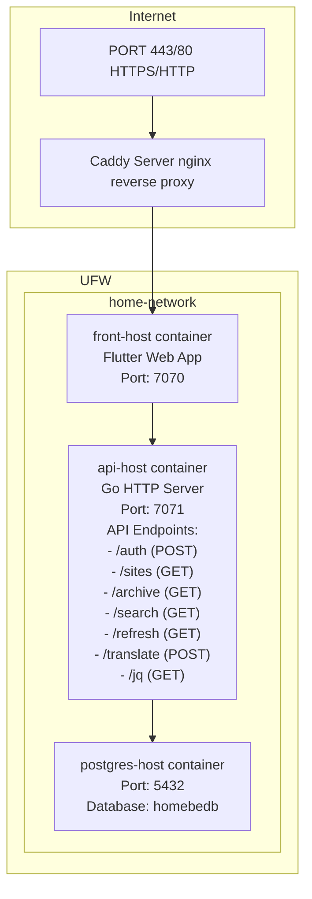

# System Architecture

## Overview

A Flutter (Dart) frontend application communicating with a Golang backend, both running in Docker containers connected via a shared Docker network. The backend serves as the API layer connecting to a PostgreSQL database for persistent storage.

---

## 1. Application Layers

### Frontend (home_fe)
- **Language**: Dart/Flutter
- **Port**: 7070
- **Container Name**: `front-host`
- **Reverse Proxy**: Nginx (HTTPS via Caddy config)
- **Architecture**: Mobile/Desktop/Web hybrid app
- **Key Features**: 
  - RSS feed aggregation and display
  - Multi-platform support (iOS, Android, Desktop)
  - Localization support (English, Thai locales)
  - Image caching with thumbnail generation

### Backend (home_be)
- **Language**: Go (Golang)
- **Port**: 7071
- **Container Name**: `api-host`
- **HTTP Server**: Net/http stdlib or third-party framework
- **Database**: PostgreSQL (`postgres://postgres:<user>@<postgres.host>:<pass>/homebedb?sslmode=disable`)
- **Security**: 
  - All endpoints require `code=123` query parameter for authentication
  - CORS enabled globally

### Data Layer
- **Database**: PostgreSQL container on `home-network`
- **Port**: 5432
- **Container Name**: `postgres-host`
- **Connection String**: `postgres://postgres:<user>@<postgres.host>:<pass>/homebedb?sslmode=disable`
- **Usage**: Backend stores and retrieves news content, user preferences, configuration

---

## 2. Architecture Diagram

**Network:**



**Caddy/Nginx → Frontend → Backend → PostgreSQL**

*User requests (HTTPS) via reverse proxy serve front-end container, which communicates with backend via hostnames directly within Docker network. Database connection requires internal hostname resolution only.*

---

## 3. API Endpoints Documentation

### Backend API Endpoints (api-host:7071)

All endpoints require authentication via `code=123` query parameter.

#### Authentication Endpoints
- **POST /auth**
  - **Purpose**: User login and token refresh
  - **Request Body**: 
    ```json
    {
      "username": "string",
      "password": "string", 
      "grant_type": "password|refresh_token",
      "client_id": "clientId",
      "client_secret": "clientSecret"
    }
    ```
  - **Response**: Token object with access token, refresh token, etc.
  - **Used by**: `login()`, `refreshLogin()` methods

#### Content Management Endpoints
- **GET /sites**
  - **Purpose**: Retrieve RSS feed sites configuration
  - **Parameters**: `code=123`
  - **Response**: RssSites object with available RSS sources
  - **Used by**: `sites()` method

- **GET /archive**
  - **Purpose**: Retrieve archived news items with pagination
  - **Parameters**: 
    - `code=123` (required)
    - `offset` (optional, default: 0) - Pagination offset
    - `limit` (optional, default: 10) - Items per page
    - `lang` (optional) - Language filter
  - **Response**: NewsItems object with archived articles
  - **Used by**: `archive()` method

- **GET /search**
  - **Purpose**: Search news articles by query
  - **Parameters**:
    - `code=123` (required)
    - `q` (required) - Search query string
    - `lang` (optional) - Language filter
  - **Response**: NewsItems object with search results
  - **Used by**: `search()` method

- **GET /refresh**
  - **Purpose**: Trigger refresh of RSS feeds/content
  - **Parameters**: `code=123`
  - **Response**: Status code and data
  - **Used by**: `refresh()` method

#### Translation Endpoints
- **POST /translate**
  - **Purpose**: Translate text/answer questions
  - **Request Body**:
    ```json
    {
      "question": "string"
    }
    ```
  - **Parameters**: `code=123`
  - **Response**: AnswerBody object with translated content
  - **Used by**: `answerToQuestion()` method

#### Configuration Endpoints
- **GET /jq**
  - **Purpose**: Retrieve backend configuration
  - **Parameters**: `code=123`
  - **Response**: Config object with backend settings
  - **Used by**: `getConfig()` method

### Frontend API Client Implementation

The Flutter frontend uses the `ApiRepository` class with the following pattern:
```dart
// All requests follow this structure:
List<Future<dynamic>> futures = [];
futures.add(client.get('/endpoint', parameters: {"code": "123"}));
List<dynamic> results = await Future.wait(futures);
```

**Key Implementation Details**:
- Uses `Future.wait()` for concurrent request handling
- All endpoints include `code=123` authentication parameter
- Error handling with try-catch blocks and logging
- Response parsing into strongly-typed Dart objects (PODOs)

---

## 4. Communication Patterns

### Frontend ↔ Backend API

**Request Format**:
```dart
// Flutter frontend makes requests like:
Dio().get(
  'http://api-host:7071/sites', 
  queryParameters: { 'code': '123' }
);
```

**Backend Response Format**:
```json
{
  "status": 200,
  "data": {
    "sites": [
      {
        "name": "Site Name",
        "url": "https://example.com/rss",
        "language": "en"
      }
    ]
  }
}
```

**Authentication**: All requests require `code=123` query parameter (static/hardcoded auth)

### Docker Container Communication

- **Network**: `home-network` (user-defined bridge network)
- **Service Discovery**: Containers communicate via container names (`api-host`, `front-host`)
- **No DNS needed** within the same network - direct hostname resolution

---

## 5. Frontend Stack & Dependencies

### Core Flutter Packages
```yaml
dio:                          # HTTP client for API calls
flutter_bloc:                 # State management (Bloc pattern)
go_router:                    # Navigation/Router
cached_network_image:         # Image caching
rss_dart:                     # RSS feed parsing
html:                         # HTML rendering for feed content
timeago:                      # Relative time formatting ("2h ago")
flutter_svg:                  # SVG image support
share_plus:                   # Native share integration
```

### Assets Structure
```
assets/
├── app-logo.svg              # Primary logo
├── app-logo-light.svg        # Light background variant
└── thumbnails/               # Feed thumbnail cache
    ├── random.svg            # Default/fallback thumbnail
    ├── phoronix.svg
    ├── slashdot.svg
    ├── techcrunch.svg
    └── ... (other feed logos)

assets/flags/
├── flag-en.svg              # English locale
├── flag-th.svg              # Thai locale
├── flag-fi.svg              # Finnish locale
├── flag-de.svg              # German locale
└── flag-jp.svg              # Japanese locale
```

---

## 6. Backend Stack & Dependencies

### Go Module Dependencies (from Makefile)
```bash
github.com/mmcdole/gofeed      # RSS feed parsing
github.com/google/uuid         # UUID generation
github.com/lib/pq              # PostgreSQL driver
github.com/rifaideen/talkative # Custom utility/library
github.com/joho/godotenv       # Environment variable loader
github.com/tailscale/hujson    # JSON parsing with pretty-print support
```

### Makefile Targets
- `make dep`     → Install vendor dependencies
- `make vet`     → Run go vet linter
- `make build`   → Build binary for current platform
- `make debug`   → Debug build (with dev index.html)
- `make release` → Production build (with release index.html)
- `make run`     → Run local development server
- `make clean`   → Clean build artifacts

### Build Modes

**Debug Mode**:
```bash
make debug
# Uses: index.debug.html
# GOARCH detection for platform-specific builds
```

**Release Mode**:
```bash
make release
# Uses: index.release.html
# Production optimizations
```

---

## 7. Docker Configuration

### Frontend Dockerfile (Multi-stage)
```dockerfile
# Stage 1: Build Flutter app
FROM ghcr.io/cirruslabs/flutter:3.38.6 AS builder
WORKDIR /homefe
COPY . .
RUN ./build.sh

# Stage 2: Serve with Nginx
FROM nginx:stable-alpine
COPY --from=builder /homefe/nginx/nginx.https_wasm.conf /etc/nginx/conf.d/default.conf
COPY --from=builder /homefe/build/web /app/web
EXPOSE 7070
```

### Backend Dockerfile
```dockerfile
FROM golang:1.24
RUN apt update && apt install -y make
ENV PATH="/usr/bin:${PATH}"
WORKDIR /homebe
COPY . .
RUN rm -f go.mod && rm -f go.sum && ./build.sh
EXPOSE 7071
CMD ["./home_be_backend"]
```

### Deployment Commands

**Setup Network**:
```bash
sudo docker network create home-network
```

**Build & Run Frontend**:
```bash
sudo docker build --no-cache -f Dockerfile -t news-frontend .
sudo docker run \
  --name front-host \
  --network home-network \
  -p 7070:7070 \
  --restart always \
  -d news-frontend

sudo docker network connect home-network front-host
```

**Build & Run Backend**:
```bash
sudo docker build --no-cache -f Dockerfile -t news-backend .
sudo docker run \
  --name api-host \
  --network home-network \
  -p 7071:7071 \
  --restart always \
  -d news-backend

sudo docker network connect home-network api-host
```

---

## 8. Environment Configuration

### Frontend (.env.example)
```bash
ENV=release                   # Build environment
REL=release1                  # Release variant
APP_API=http://api-host:7071  # Backend API endpoint
```

### Backend (.env.example)
```bash
ENV=debug                     # Build environment (debug/release)
DATABASE_URL=postgres://postgres:<user>@<postgres.host>:<pass>/homebedb?sslmode=disable
```

---

## 9. Development Workflow

### Frontend Development Steps
```bash
# Install dependencies
dart run build_runner build --delete-conflicting-outputs
flutter pub get

# Hot reload development
flutter run -d chrome

# Docker deployment
./build.sh
sudo docker build ...
```

### Backend Development Steps
```bash
# Setup Go environment
sudo apt install -y golang make
go mod init github.com/janevala/home_be

# Install dependencies (from Makefile)
make dep

# Lint code
make vet

# Run local development
make run

# Build for deployment
make release
```

---

## 10. Security Considerations

### Authentication
- **Backend**: All endpoints require `code=123` query parameter
- **Frontend**: No client-side authentication (relies on backend)
- **Database**: SSL disabled in connection string (`sslmode=disable`)

### CORS Configuration
- Backend enables CORS for all origins (development mode)
- Should be restricted in production

### Network Security
- Uses HTTPS via Caddy reverse proxy
- Docker network isolation between containers
- Database on separate host requires external access control

---

## 11. Future Enhancements

### Frontend TODOs
- [ ] Detect available translations/ping for i18n support
- [ ] Add backend server stats to frontend monitoring page
- [ ] Implement Thai locale with Buddhist Era calendar
- [ ] Configure analytics tracking and account management
- [ ] Optimize image loading strategies

### Backend Improvements
- [ ] Document all API endpoints with OpenAPI/Swagger
- [ ] Add rate limiting for public endpoints
- [ ] Implement proper authentication (JWT/OAuth2)
- [ ] Add structured logging
- [ ] Create health check endpoint

---

## 12. Quick Reference

### Port Summary

| Service                   | Internal Port | External Port | Protocol   | Description              |
|---------------------------|---------------|---------------|------------|--------------------------|
| Frontend (Flutter Web)    | 7070          | 7070          | HTTPS      | Serves web app to users  |
| Backend (API)             | 7071          | 7071          | HTTPS      | REST API for frontend    |
| PostgreSQL Database       | 5432          | -             | TCP        | Persistent data storage  |

### Network Communication

```
┌─── Frontend Container (front-host) ────┐
│    Flutter Web App                     │
│    go_router handles navigation        │
│                                        │
│    HTTP API Calls:                     │
│    Dio().get('http://api-host:7071/')  │
└──────────────┬─────────────────────────┘
               │ REST/JSON Requests
               ▼
┌─── Backend Container (api-host) ───────┐
│    Go HTTP Server                      │
│    Port 7071                           │
│                                        │
│    API Endpoints:                      │
│    - /feed                             │
│    - /news                             │
│    - /articles                         │
│    - /<incomplete>                     │
│                                        │
│    Auth: ?code=123                     │
└──────────────┬─────────────────────────┘
               │ Database Queries
               ▼
┌─── PostgreSQL Container ───────────────────┐
│    postgres-host                           │
│    Database: homebedb                      │
│    Tables: feed_items, feed_translations   │
└────────────────────────────────────────────┘

Docker Network: home-network
- Service Discovery by hostname only
- No external DNS required

Docker Context: production-context
- During production pipeline deployment
```

### Environment Variables Cheat Sheet

| Variable             | Frontend Value                   | Backend Value                                      | Purpose                              |
|----------------------|----------------------------------|----------------------------------------------------|--------------------------------------|
| **ENV**              | debug or release                 | debug or release                                   | Build environment                    |
| **REL**              | release1                         | -                                                  | Release variant                      |
| **APP_API**          | http://api-host:7071             | -                                                  | Backend API endpoint for frontend    |
| **DATABASE_URL**     | -                                | postgres://postgres:<pass>@host/db?sslmode=disable | Database connection string           |
| **GOOS**             | -                                | linux (default)                                    | Go target OS                         |
| **GOARCH**           | -                                | amd64/aarch64 (auto-detected)                      | Go target architecture               |

**Note**: Always set `.env` and `config.json` files before Docker build or production deployment.

---

## 13. Contact & Resources

### Repository Links
- **Frontend**:      https://github.com/janevala/home_fe
- **Backend**:       https://github.com/janevala/home_be
- **Data pipeline**: https://github.com/janevala/home_be_crawler

### Build Outputs
- Frontend: `build/web/`
- Backend: Compiled binary `home_be_backend`
