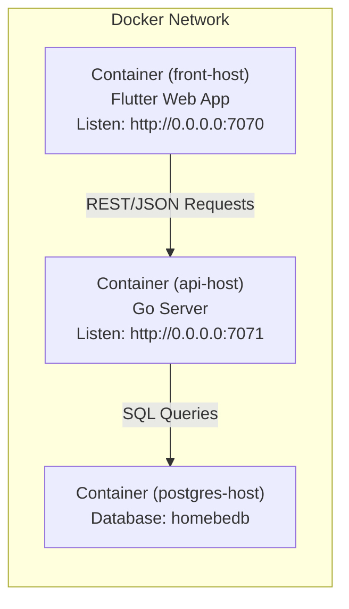

# News Frontend
 
[Documentation](DOC.md)

## Get Started
- .env
- .vscode/launch.json
- pipeline.sh

---

## Quick Reference

### Port Summary

| Service                   | Internal Port | External Port | Protocol   | Description              |
|---------------------------|---------------|---------------|------------|--------------------------|
| Frontend (Flutter Web)    | 7070          | 7070          | HTTPS      | Serves web app to users  |
| Backend (API)             | 7071          | 7071          | HTTPS      | REST API for frontend    |
| PostgreSQL Database       | 5432          | -             | TCP        | Persistent data storage  |

### Network Communication



Docker Network: home-network
- Service Discovery by hostname only
- No external DNS required

Docker Context: production-context
- During production pipeline deployment

### Environment Variables Cheat Sheet

| Variable             | Frontend Value                   | Backend Value                                            | Purpose                              |
|----------------------|----------------------------------|----------------------------------------------------------|--------------------------------------|
| **ENV**              | debug or release                 | debug or release                                         | Build environment                    |
| **REL**              | release1                         | -                                                        | Release variant                      |
| **APP_API**          | http://0.0.0.0:7071              | -                                                        | Backend API endpoint for frontend    |
| **DATABASE_URL**     | -                                | postgres://postgres:<pass>@host/homebedb?sslmode=disable | Database connection string           |
| **GOOS**             | -                                | linux (default)                                          | Go target OS                         |
| **GOARCH**           | -                                | amd64/aarch64 (auto-detected)                            | Go target architecture               |

**Note**: Always set `.env` and `config.json` files before Docker build or production deployment.

---

## Docker Configuration

### Frontend Dockerfile (Multi-stage)
```dockerfile
# Stage 1: Build Flutter app
FROM ghcr.io/cirruslabs/flutter:3.41.5 AS builder
WORKDIR /homefe
COPY . .
RUN ./build.sh

# Stage 2: Serve with Nginx
FROM nginx:stable-alpine
COPY --from=builder /homefe/nginx/nginx.https_wasm.conf /etc/nginx/conf.d/default.conf
COPY --from=builder /homefe/build/web /app/web
EXPOSE 7070
```

### Backend Dockerfile
```dockerfile
FROM golang:1.24
RUN apt update && apt install -y make
ENV PATH="/usr/bin:${PATH}"
WORKDIR /homebe
COPY . .
RUN rm -f go.mod && rm -f go.sum && ./build.sh
EXPOSE 7071
CMD ["./home_be_backend"]
```

### Deployment Commands

**Setup Network**:
```bash
sudo docker network create home-network
```

**Build & Run Frontend**:
```bash
sudo docker build --no-cache -f Dockerfile -t news-frontend .
sudo docker run \
  --name front-host \
  --network home-network \
  -p 7070:7070 \
  --restart always \
  -d news-frontend

sudo docker network connect home-network front-host
```

**Build & Run Backend**:
```bash
sudo docker build --no-cache -f Dockerfile -t news-backend .
sudo docker run \
  --name api-host \
  --network home-network \
  -p 7071:7071 \
  --restart always \
  -d news-backend

sudo docker network connect home-network api-host
```

---

## Environment Configuration

### Frontend (.env.example)
```bash
ENV=release                   # Build environment (debug/release)
REL=release1                  # Release number
APP_API=http://0.0.0.0:7071   # Backend API endpoint
```

### Backend (.env.example)
```bash
ENV=release                   # Build environment (debug/release)
DATABASE_URL=postgres://postgres:<pass>@host/homebedb?sslmode=disable
```

---

## Development Workflow

### Frontend Development Steps
```bash
# Install dependencies
dart run build_runner build --delete-conflicting-outputs
flutter pub get

# Hot reload development
flutter run -d chrome

# Docker deployment
./build.sh
sudo docker build ...
```

### Backend Development Steps
```bash
# Setup Go environment
sudo apt install -y golang make
go mod init github.com/janevala/home_be

# Install dependencies (from Makefile)
make dep

# Lint code
make vet

# Run local development
make run

# Build for deployment
make release
```

---

## Future Enhancements

### Frontend TODOs
- [ ] Detect available translations/ping for i18n support
- [ ] Add backend server stats to frontend monitoring page
- [ ] Implement Thai locale with Buddhist Era calendar
- [ ] Configure analytics tracking and account management
- [ ] Optimize image loading strategies

### Backend Improvements
- [ ] Document all API endpoints with OpenAPI/Swagger
- [ ] Add rate limiting for public endpoints
- [ ] Implement proper authentication (JWT/OAuth2)
- [ ] Add structured logging
- [ ] Create health check endpoint
- [ ] Crawler/translator in Docker
- [ ] `golang-migrate` for version-controlled database migrations
- [ ] Monitoring with https://prometheus.io
